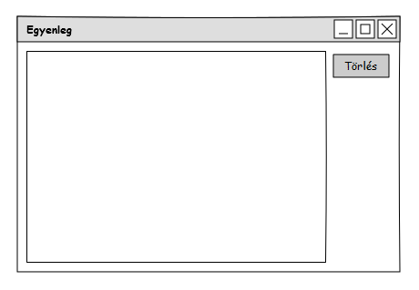

Alkalmazások fejlesztése beadandó feladat

**Családi büdzsé**

**1. Követelményanalízis**

*Célkitűzés, projektindító dokumentum*

A program legfőbb célja, hogy jól átláthatóan kezelje a család, illetve a saját bevételeinket/kiadásainkat. Az adatok védelme érdekében van lehetőség regisztrációra, majd bejelentkezésre. A regisztrált személy létre tud hozni családot, amibe a családtagjait be tudja hívni egy regisztrációs link segítségével. A családtagok bizonyos jogosultságokkal rendelkezhetnek, ennek módosítására van lehetőség.

*Funkcionális követelmények:*

-   Regisztráció

-   Bejelentkezés

-   Regisztrált személy

    - Család regisztrálása

    - Kiadás/bevétel hozzáadása/törlése

    - Egyenleg megtekintése

    - Kilépés

- Családtag

    - Családtag hozzáadása/törlése

    - Családi egyenleg megtekintése

*Nem funkcionális követelmények:*

-   Megbízhatóság: Jelszóval védett funkciók.

-   Használhatóság: Könnyű áttekintés.

*Használatieset-modell*

- Bejelentkezés nélkül elért oldalak

    - Bejelentkezés

- Bejelentkezéssel elért oldalak

    - Családtag

    - Regisztrált személy

**2. Tervezés**

*Architektúra terv*

*Oldaltérkép*

*Felhasználói-felület modell*

*Oldalvázlatok*

*Osztálymodell*

*Végpontok*

-   GET/egyenleg: egyenleg oldal betöltése

-   POST/egyenleg: elmenti az adatokat az egyenleg oldalról

-   GET/egyenleg/:id/delete: kitörli az adott költséget

-   GET/: kijelentkezés esetén a loginra irányít, bejelentkezés esetén az egyenleg oldalra

-   GET/csalad: ha nem vagy családban akkor átirányít a család létrehozására, ha be vagy regisztrálva családhoz akkor pedig a családod oldalára irányít

-   GET/csalad/join/:id: a regisztrációs link alapján hozzáad a családodhoz

-   GET/csalad/create: család létrehozása oldal betöltése

-   POST/csalad/create: elmenti az adatokat a család létrehozása oldalról

-   GET/csalad/:id/delete: családtag törlése

-   POST/csalad/jogosultsag: családtag jogosultságainak elmentése

-   GET/register: regisztrációs oldal betöltése

-   GET/login: bejelentkező oldal betöltése

-   POST/register: a regisztrációs oldalról elmenti az adatokat

-   POST/login: sikeres bejelentkezés után átirányít

-   GET/logout: kijelentkezés

**3. Implementáció**

*Fejlesztőkörnyezet*

- Webstorm

- GitHub

    - GitHub account szükséges.

    - GitHubra való feltöltés menete: a git add -A paranccsal az összes fájlt kiválasztjuk, majd a git commit -a -m "Szöveges üzenet" paranccsal feltehetjük a fájlokat a helyi tárolóba, később az így megjelölt verziót visszakereshetjük. Végül a git push origin master paranccsal a lokális tárolóból feltölthetjük a tartalmat a GitHubra.

    - GitHub oldalán leellenőrizhetjük a munkánkat.

*Könyvtárstruktúra, funkciók*

- alkfejl

    - CsaladiBudzse

        - app

            - Commands

                - Greet.js

            - Http

                - Controllers

                    - BudzseController.js

                    - CsaladController.js

                    - UserController.js

                - Middleware

                - kernel.js

                - routes.js

            - Listeners

                - Http.js

            - Model

                - Hooks

                - Csalad.js

                - Jogosultsag.js

                - Koltseg.js

                - Token.js

                - User.js

        - bootstrap

            - app.js

            - events.js

            - extend.js

            - http.js

            - kernel.js

        - config

            - express-admin

                - config.json

                - custom.json

                - settings.json

                - users.json

            - app.js

            - auth.js

            - bodyParser.js

            - cors.js

            - database.js

            - event.js

            - session.js

            - shiled.js

        - database

            - migrations

                - 1479557571106\_koltsegek.js

                - 1479557969429\_csaladok.js

                - 1479558111037\_jogosultsagok.js

                - 1479558626788\_create\_users\_table.js

                - 1479558626790\_create\_tokens\_table.js

                - 1479588847859\_jogosultsag\_user.js

            - seeds

                - Database.js

            - development.sqlite

            - factory.js
			
        - providers

        - public

            - assets

                - favicon.png

                - github.svg

                - logo.svg

                - twitter.svg

            - scripts

                - delete.js

                - egyenleg\_timer.js

                - smart\_egyenleg.js

            - style.css

        - resources

            - views

                - errors

                    - index.njk

                - csalad.njk

                - csaladCreate.njk

                - egyenleg.njk

                - login.njk

                - master.njk

                - register.njk

        - storage

        - tests

            - csalad\_letrehozasa.html

            - csaladi\_budzse

            - egyenleg\_felvitel\_torles.html

            - jogosultsag\_hozzaadasa\_megvonasa.html

            - regisztracio\_bejelentkezes\_kijelentkezes.html

        - CHANGELOG.md

        - README.md

        - ace

        - ace.cmd

        - package.json

        - server.js

    - media

        - image1.png

        - image2.png

        - image3.png

        - image4.png

        - image5.png

        - image6.png

        - image7.png

        - image8.png

        - image10.png

**4. Funkciók**

-   jogosultság kezelése felugró ablakkal

-   új költség hozzáadásánál az időpontot egy naptárból kell kiválasztani

-   egyenleg oldalon új költség hozzáadásánál, ha egy mező üresen marad, azt piros színnel bekeretezi, illetve tájékoztató üzenet jelenik meg a mező alatt

-   miközben az egyenleg oldalon a "mire" mezőt töltjük ki javaslatokat ad, hogy mit írhatunk be (smart\_egyenleg.js)

-   a családi egyenleget 5 másodpercenként frissíti az oldal, ha valaki közben új költséget vesz fel magához (egyenleg\_timer.js)

-   költség törlése esetén az oldal újra betöltése nélkül le lehet törölni egy adott sort, illetve egy megerősítő ablak felugrik, hogy biztosan le akarjuk e törölni

**5. Tesztelés**

*Tesztelési környezet*

Kétféle tesztelési módszert ismerünk a program teljes körű teszteléséhez. Vannak az egységtesztek, ami a mocha keretrendszer és a chai ellenőrző könyvtár segítségével történik. Egységtesztelés közben a modellek működését, a problémamentes funkciókat és műveleteket ellenőrizzük. Illetve van a funkcionális tesztelés, aminek segítségével a végpontokat ellenőrizzük, a megfelelő tartalom megjelenését és az oldalak működőképességét. Mi az utóbbival fogjuk a programunkat tesztelni.

*Funkcionális tesztelés*

A Selenium IDE-vel valósult meg a tesztelés. A teszteléshez Mozilla Firefox szükséges, ezután le kell tölteni a Selenium IDE-t a kiegészítők közül, majd elindítani és a Base Urlbe beállítani a http://localhost:3000/ urlt. Létre kell hozni egy új test suite-ot, majd a következő test case-ket hoztam létre:

-   regisztracio\_bejelentkezes\_kijelentkezes: egy új embert regisztrál a rendszerben, majd belépteti őt és a végén kijelentkezik

-   egyenleg\_felvitel\_torles: felvisz egy bevételt a rendszerbe, majd kitörli azt

-   csalad\_letrehozasa\_csaladtag\_hozzaad: egy adott felhasználóval létrehozunk egy családot, kimásoljuk tőle a regisztrációs linket, majd kijelentkezünk. Bejelentkezünk egy másik felhasználóval aki megnyitja ezt a regisztrációs linket és így már ő is a családba tartozik. (Szekvencia diagramon megvalósítva)

-   jogosultsag\_hozzaadasa\_megvonasa: a meglévő család egyik tagjának adunk jogosultságokat, majd valamelyiket elvesszük tőle

**6. Szekvencia diagram**

**7. Felhasználói dokumentáció**

*Futtatáshoz szükséges operációs rendszer, hardver:* tetszőleges

*Egyéb követelmények:* internet böngésző telepítése, JavaScript ajánlott a felhasználói élmény javítása érdekében

*Program használata:*

1.  Böngészőben nyissuk meg a főoldalt

2.  Jobb felső sarokban regisztráció szükséges, amennyiben még nincs

3.  Bejelentkezés után megtekinthetjük az egyenlegünket

4.  Kiadást/bevételt egyaránt fel tudunk venni az adatok kitöltése után

5.  A felső sorban bal oldalon létre tudunk hozni egy új családot, illetve be tudunk lépni egy már meglévő családban, ha a családtag elküldi nekünk a linket (pl. facebookon)

6.  Miután regisztráltunk egy családhoz ott megtekinthetjük a család egyenlegét és a jogosultságokat
