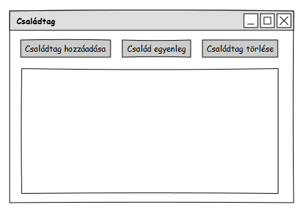
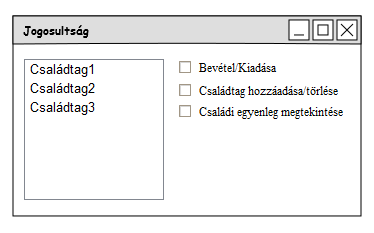

Alkalmazások fejlesztése beadandó feladat

**Családi büdzsé**

**1. Követelményanalízis**

Célkitűzés, projektindító dokumentum

A program legfőbb célja, hogy jól átláthatóan megjelenítse a család, illetve a saját bevételeinket/kiadásainkat. Az adatok védelme érdekében van lehetőség regisztrációra, majd bejelentkezésre. A regisztrált személy tud létrehozni családot, amibe a családtagokat hozzá tudja adni, majd be tud nekik adni bizonyos jogosultságokat.

Funkcionális követelmények:

- Regisztráció

- Bejelentkezés

- Regisztrált személy

    - Család regisztrálása

    - Kiadás/bevétel hozzáadása/törlése

    - Egyenleg megtekintése

    - Kilépés

- Családtag

    - Családtag hozzáadása/törlése

    - Családi egyenleg megtekintése

Nem funkcionális követelmények:

-   Megbízhatóság: Jelszóval védett funkciók.

-   Használhatóság: Könnyű áttekintés.

Használatieset-modell

- Bejelentkezés nélkül elért oldalak

    - Bejelentkezés

- Bejelentkezéssel elért oldalak

    - Családtag

    - Regisztrált személy

**2. Tervezés**

Architektúra terv

*Oldaltérkép*

Felhasználói-felület modell

*Oldalvázlatok*

Osztálymodell

**3. Implementáció**

Fejlesztőkörnyezet

-   Webstorm

-   GitHub

**4. Tesztelés**

Tesztesetek
